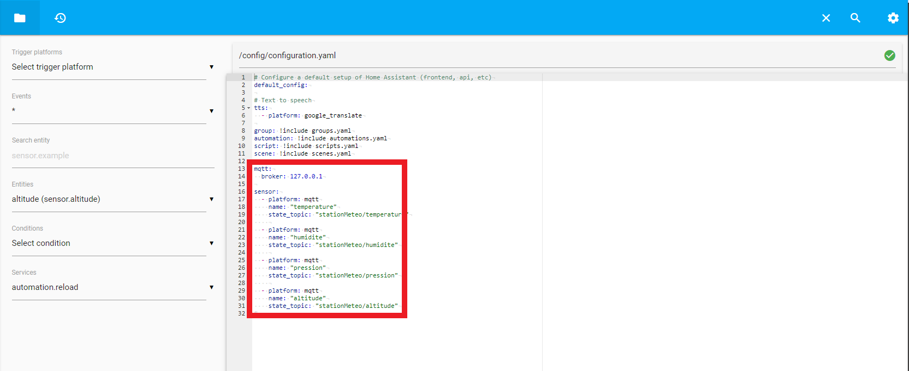

# Station météo – Manuel d’utilisation
## Information(s) pertinente(s)s :
- L’altitude est basée sur la pression atmosphérique (hPa). Étant donné que la pression change souvent même en restant à la même altitude, les données sur l’altitude ne sont qu’une estimation très peu précise.
- Si la station semble ne pas fonctionner comme elle devrait, seulement la redémarrer à l'aide du commutateur physique près de la pile. Étant donné que la station sauvegarde les configurations, elle se relancera sans problème.

## Fonctionnement général de la station météo
La station météo, très simple à utiliser, fonctionne de cette manière. Lorsque vous la démarrez en déplaçant le commutateur de la pile vers la droite, elle essaie de se connecter à un Wifi dans sa zone de réception. Naturellement, c'est si un de ces réseau a été configuré dans le passé. À son premier démarrage, la station se mettra en point d'accès et toutes les étapes à suivre sont indiquées plus loin dans ce manuel! N'oubliez pas que ce modèle a été pensée et développée de sorte qu'elle est assez dépendante de logiciels qui reçoivent des messages de type 'File De Message'. Il vous faut un Serveur de file de message (voir la partie sur la configuration du logiciel de domotique et de la station). Après la connexion Wifi, la station météo tente de se connecter au serveur de messages.

Lorsque la station est bien configurée, elle a ces fonctionnalités suivantes:
- La station est 100% sans fil, lorsqu'elle n'a pas besoin d'être rechargée. En effet, en utilisant le WiFi pour sa connectivité réseau et une pile pour son alimentation, vous pourrez la déplacer où bon vous semble.
- La durée de vie de la pile est d'environ 20 heures à pleine charge.
- Envoyer des données barométriques (Température, Pression, Humidité, Altitude) a des appareils connectés sur une application de domotique.
- Afficher sur le LCD en alternance de 4 secondes les informations suivantes: Température Et Pression / Humidite et Altitude / État de la météo extérieure 
- Informer via le LCD de quelques informations au niveau de la configuration (ERREUR MQTT / File de message domotique) (Mode Point Acces Active). À Chaque boucle du LCD, si la connexion au serveur de message est perdue, le système tentera de se reconnecter. Le cas échéant, le programme poursuit son exécution.
- Le bouton jaune lance le portail de configuration réseau de la station. Il suffit d'appuyer sur le bouton, puis à l'aide d'un appareil WiFi il est possible de se connecter et de reconfigurer tous les paramètres réseaux nécessaires. C'est la façon la plus simple et sur demande de modifier vos paramètres réseaux (WiFi et Serveur)

## Configurations du logiciel de domotique
*Ce manuel d’utilisation explique comment utiliser Home Assistant. Si vous souhaitez utiliser un autre logiciel de domotique, vous devrez vous référencer à la documentation de celui-ci pour le configurer mais vous pourrez l’utiliser tant que vous fournissez l’adresse ip et le port du logiciel dans la configuration de la station ainsi que le nom d’utilisateur et le mot de passe de votre file de messages.*

### Téléchargement :
Vous devez tout d’abord télécharger l’image d’Home Assistant à partir de cette adresse : https://github.com/home-assistant/operating-system/releases/download/5.12/hassos_ova-5.12.ova

### Démarrage de la machine virtuelle
Une fois téléchargée, vous devez démarrer la machine virtuelle (le fichier téléchargé précédemment) à l’aide d’un gestionnaire de machines virtuelles (Virtualbox/VMware) et vous assurer dans les paramètres de la machine virtuelle via le gestionnaire que le mode d’accès réseau est en « Accès par pont ». 


Connectez-vous avec l’identifiant par défaut « root ». Il arrive qu’il y ait un problème de fuseau horaire (de certificat). Le système vous dira qu’il est en mode « emergency », vous devez écrire la commande login puis réécrire « root » à répétition jusqu’à ce que ça fonctionne.


### Accès à l’interface client
Vous pouvez maintenant accéder à l’interface client de Home Assistant en entrant l’adresse ip (qui est affichée dans le terminal de la machine virtuelle) dans un navigateur suivi du port (8123 par défaut) sur un appareil connecté au même réseau que celle-ci (Ex : 192.168.1.85:8123). Une fois arrivé sur l’interface, il vous demandera de créer un utilisateur. Vous en aurez besoin dans la configuration de la station.


### Réception des données de la station météo dans Home Assistant
Vous devez d'abord aller dans l’onglet supervisor puis « Add-on store » pour ajouter « Mosquitto Broker » qui permettra de recevoir les messages envoyés par la station et « File Editor » qui nous permettra de modifier le fichier de configuration. Assurez-vous de démarrer « Mosquitto Broker ». Une fois la station météo configurée, elle pourra envoyer de l’information à « Mosquito Broker » et Home assistant pourra récupérer cette information pour l’afficher grâce aux configurations dans les prochaines étapes.


### Ajout de capteurs
Vous pouvez maintenant démarrer « File Editor » puis cliquez sur « OPEN WEB UI » pour modifier le fichier configuration.yaml.


Cliquez sur le dossier blanc en haut en gauche puis chercher le fichier configuration.yaml 



 Ajoutez les lignes suivantes à la fin (Attention à l’indentation) :

```yaml
mqtt:
  broker: 127.0.0.1
```

Ces lignes spécifient que c'est Home Assistant lui-même qui traite les messages de la station météo. Nous pouvons maintenant ajouter des capteurs :

```yaml
sensor:
  - platform: mqtt
    name: "temperature"
    state_topic: "stationMeteo/temperature"
    
  - platform: mqtt
    name: "humidite"
    state_topic: "stationMeteo/humidite"
    
  - platform: mqtt
    name: "pression"
    state_topic: "stationMeteo/pression"
    
  - platform: mqtt
    name: "altitude"
    state_topic: "stationMeteo/altitude"
```

Ces capteurs permettent de recevoir les 4 informations envoyées par la station météo indépendemment. Ceci permet de faire un affichage unique pour chaque valeur.

*Pour appliquer les changements, assurez vous de redémarrer la machine virtuelle.*


### Ajout de cartes
Un fois les capteurs fonctionnels, il est maintenant possible de créer des cartes qui affichent leurs valeurs. Pour cela, vous devez aller dans l’onglet « Aperçu » puis sélectionnez les 3 petits points en haut à droite et « Modifier le tableau de bord ».


Vous pouvez maintenant cliquer sur le bouton « Ajouter une carte » qui apparaîtra en haut à droite. Vous pouvez par exemple créer une jauge qui utilisera l'un des capteurs que nous avons créés précédemment. Ils n’afficheront rien pour l’instant car nous n’avons pas configurés la station.


## Configurations de la station
Au premier démarrage de la station météo, elle se mettra en mode point d’accès. Vous devez d’abord vous connecter au point d'accès WiFi créé par la station à l’aide d’un appareil WiFi (Ordinateur, Téléphone Cellulaire, etc.). La station apparait sous le nom de réseau (SSID) « PointAccesStationMeteo ». Connectez-vous avec le mot de passe « Station888Meteo ».


Une fois connecté à la station, vous devez entrer le nom de réseau (SSID) ainsi que le mot de passe de votre routeur pour que la station puisse s'y connecter et ainsi accéder à internet. C’est aussi à ce moment que vous devez entrer l’adresse ip et le port de votre logiciel de domotique (Home Assistant si vous avez suivis ce manuel) ainsi que le nom d’utilisateur et le mot de passe que vous avez créé à l'étape « Accès à l’interface client ». Appuyez sur sauvegarder et la station se connectera si les informations que vous avez entrées sont correctes. Si le LCD n'affiche rien, vous remarquerez que le point d'accès de la station météo est encore disponible dans les réseaux WiFi. Cela signifie que vos informations sont incorrectes et vous devez recommencer. Si les informations sont correctes, la station se connectera automatiquement au réseau WiFi saisi dans le portail web. Le système enregistrera ces informations et pourra les réutiliser même en cas de perte de courant. Si la station perd la connexion au WiFi, elle repassera automatiquement en mode point d’accès. À tout moment si vous appuyez sur le bouton jaune, la station passera en mode point d’accès et vous pourrez modifier la configuration réseau.